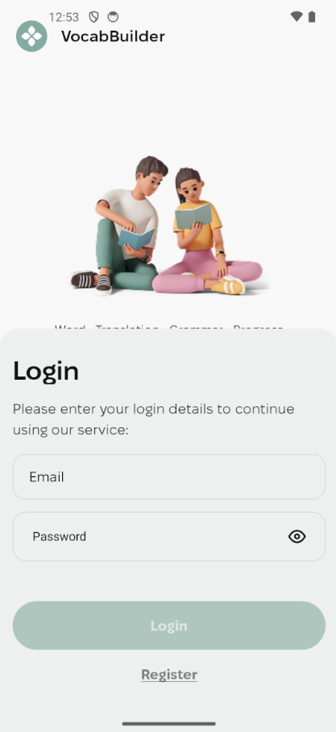
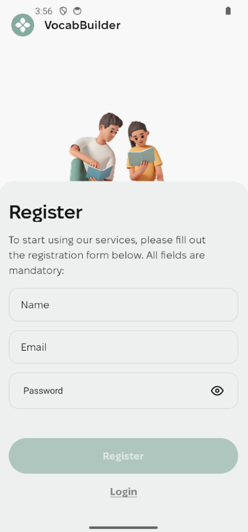
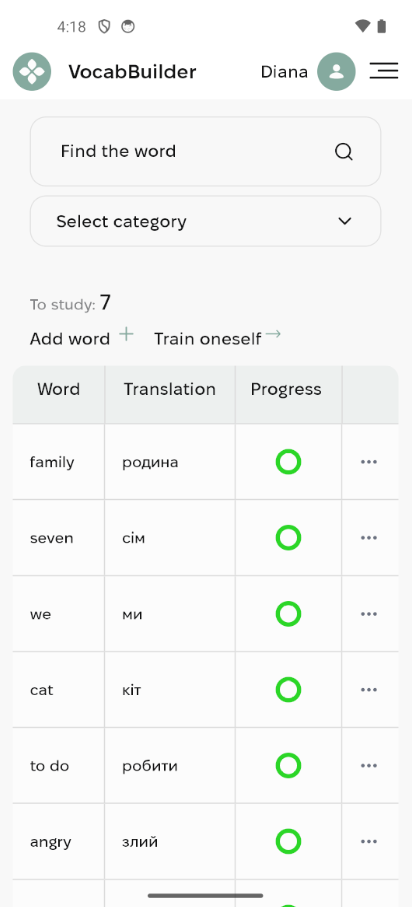
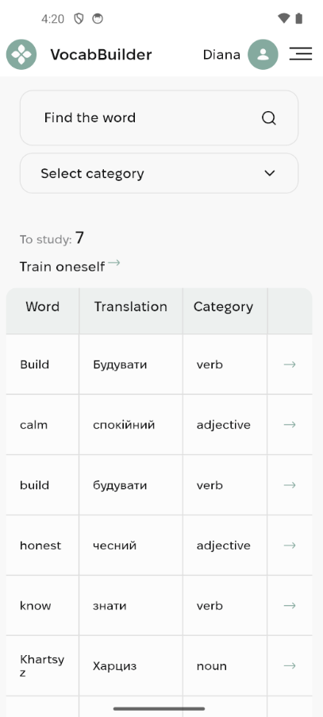
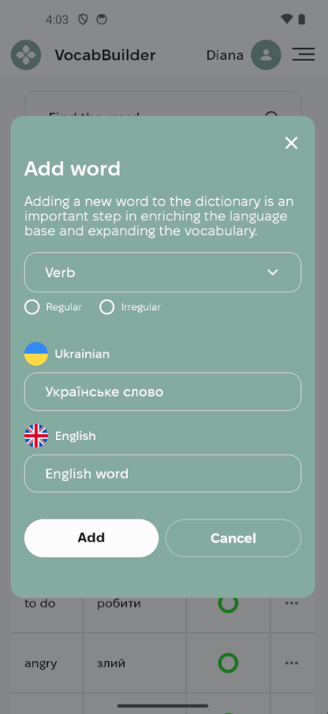
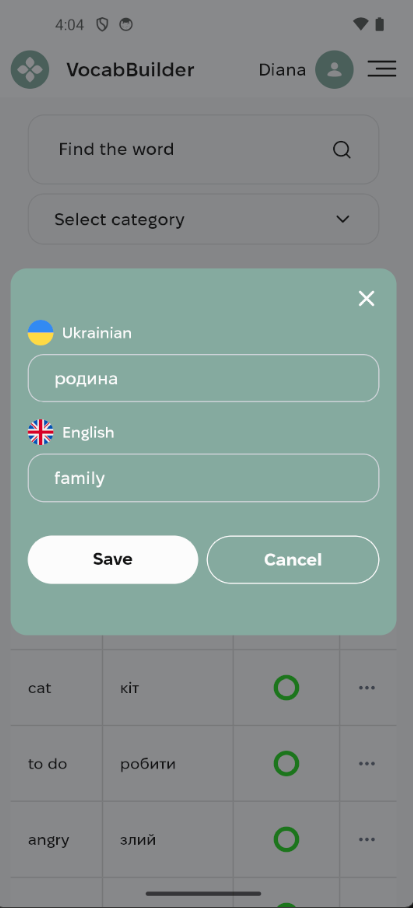
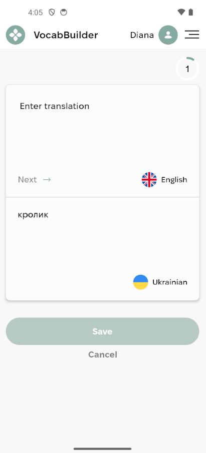

# 📘 VocabBuilder

**VocabBuilder** is a cross-platform mobile application built with React Native and Expo that helps users effectively build and train English vocabulary through an interactive learning system.

The app combines dictionary management, filtering, and training mechanics into a seamless user experience.

---

# 🚀 Demo

👉 Android APK: https://drive.google.com/file/d/1nHm-dSry28YsHmVDrZCTF3eDxTbAyTMz/view?usp=sharing

---

# 📱 Screenshots

## 🔐 Authentication

| Login                         | Register                            |
| ----------------------------- | ----------------------------------- |
|  |  |

## 📖 Main Screens

| Dictionary                              | Recommend                             |
| --------------------------------------- | ------------------------------------- |
|  |  |

## ✏️ Word Management

| Add Word                       | Edit Word                        |
| ------------------------------ | -------------------------------- |
|  |  |

## 🎯 Training

| Training                            | Well Done                        |
| ----------------------------------- | -------------------------------- |
|  |  |

---

# ✨ Features

### 🔐 Authentication

- JWT-based authentication
- Persistent sessions using AsyncStorage
- Protected routes with conditional navigation

### 📖 Dictionary Management

- Add, edit, and delete words
- Category-based filtering
- Verb type handling (regular / irregular)
- Server-side pagination

### 🔍 Search & Filters

- Debounced keyword search
- Dynamic category loading
- Conditional UI rendering

### 🎯 Training System

- Backend-driven exercises
- Real-time progress tracking
- Result summary screen

### ⚙️ UX & Performance

- Optimized FlatList rendering
- Smooth keyboard handling
- Reusable UI components
- Error handling with user notifications

---

# 🧠 Architecture

The project follows a scalable feature-based architecture:

- Redux Toolkit for global state management
- RTK Query for API communication and caching
- Expo Router for file-based navigation
- Separation of UI and business logic

### Reusable Components

- Dashboard
- WordsTable
- WordsPagination
- ProgressBar

---

# 🔄 Navigation Flow

### Unauthenticated:

- Login
- Registration

### Authenticated:

- Dictionary
- Recommend
- Training

Navigation is controlled via global auth state.

---

# 📊 Training Logic

- Fetch tasks from backend
- Track user answers dynamically
- Submit results
- Display final statistics

---

# 🛠 Tech Stack

- React Native (Expo)
- TypeScript
- Redux Toolkit
- RTK Query
- Expo Router
- AsyncStorage
- react-native-modal

---

# ⚡ Challenges & Solutions

### Keyboard overlapping inputs (Android)

Solved using ScrollView and proper keyboard handling

### FlatList re-render issues

Fixed with memoization and stable header rendering

### Auth persistence

Implemented secure token storage and hydration logic

### Network error handling

Improved error detection for offline scenarios

---

# 🚀 Getting Started

```bash
npm install
npx expo start
```

---

# 📦 Build

```bash
eas build -p android --profile preview
```

---

# 📌 Future Improvements

- Dark mode
- Offline support
- Push notifications
- Spaced repetition algorithm
